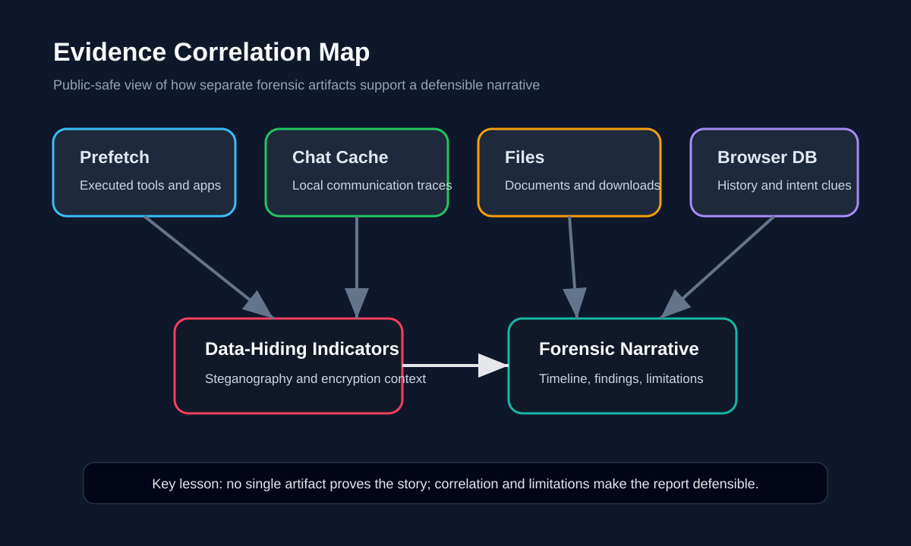
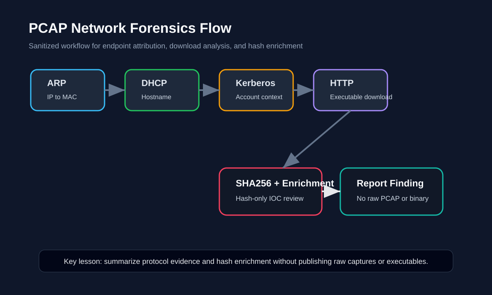

# Digital Forensics Evidence Lab

A sanitized digital forensics, OSINT, steganography, metadata, Autopsy, and PCAP-analysis portfolio project built from mock case-report work and hands-on forensic labs.

> **Disclaimer:** This repository is for defensive education and portfolio demonstration only. It does not contain raw disk images, raw PCAPs, recovered private data, real victim information, offensive social-engineering instructions, malware binaries, passwords, or unredacted assignment pages. Case names and sensitive details are generalized for public presentation.

## What This Project Demonstrates

- Evidence integrity validation using hash verification and read-only handling
- Windows disk-image investigation using application execution traces, user folders, browser history, and local communication artifacts
- Artifact correlation across Prefetch, Discord cache records, Firefox `places.sqlite`, downloads, documents, and suspicious files
- Steganography and metadata awareness using Steghide-style concepts, histogram comparison, and ExifTool-style GPS/EXIF review
- Autopsy-based file-system review, extension mismatch analysis, deleted-file review, and USB artifact interpretation
- Network forensics using Wireshark/PCAP analysis for ARP, DHCP, Kerberos, HTTP download indicators, and hash-based malware triage
- OSINT and social-engineering risk analysis reframed defensively for awareness, investigation support, and security training
- Clear forensic reporting with scope, evidence handling, findings, limitations, and follow-up recommendations

## Repository Structure

```text
.
├── README.md
├── docs/
│   ├── executive-summary.md
│   ├── forensic-case-study.md
│   ├── evidence-handling.md
│   ├── artifact-correlation.md
│   ├── steganography-metadata-lab.md
│   ├── autopsy-usb-analysis.md
│   ├── pcap-network-forensics.md
│   ├── osint-social-engineering-defense.md
│   ├── evidence-gallery.md
│   ├── screenshot-guide.md
│   ├── redaction-and-publication-checklist.md
│   ├── visuals/
│   │   ├── investigation-workflow.svg
│   │   ├── case-timeline-visual.svg
│   │   ├── evidence-correlation-map.svg
│   │   └── pcap-analysis-flow.svg
│   └── screenshots/
│       ├── README.md
│       ├── md5-integrity-validation.svg
│       └── prefetch-execution-traces.svg
├── data/
│   ├── evidence-matrix.csv
│   ├── forensic-toolchain.csv
│   └── pcap-observations.csv
└── tools/
    ├── firefox_history_export.py
    └── prefetch_name_summarizer.py
```

## Quick Portfolio Narrative

This project models a defensible forensic workflow: validate the evidence source, preserve a read-only examination path, review host and user artifacts, correlate communication and file evidence, examine data-hiding indicators, analyze PCAP evidence, and write a professional report that separates confirmed findings from limitations.

It is intentionally curated. Raw assignment pages, exact private details, full suspect/victim narratives, attack-oriented social-engineering content, raw PCAPs, and recovered evidence files are excluded.

## Visual Overview






## Public-Safe Evidence Gallery

These screenshots were extracted or recreated from the original project documentation and show real evidence-handling and artifact-review steps without publishing raw evidence files:


More annotated evidence is in [`docs/evidence-gallery.md`](docs/evidence-gallery.md).

## Portfolio Artifacts

| Artifact | Purpose |
|---|---|
| [`docs/executive-summary.md`](docs/executive-summary.md) | High-level portfolio summary for recruiters and interviewers. |
| [`docs/forensic-case-study.md`](docs/forensic-case-study.md) | Sanitized case-study narrative from evidence validation to final findings. |
| [`docs/evidence-handling.md`](docs/evidence-handling.md) | Chain-of-custody style evidence handling, hash validation, scope, and limitations. |
| [`docs/artifact-correlation.md`](docs/artifact-correlation.md) | Explains how Prefetch, Discord cache, documents, downloads, and browser history were correlated. |
| [`docs/steganography-metadata-lab.md`](docs/steganography-metadata-lab.md) | Steghide, histogram comparison, EXIF/GPS metadata, and Hashcat concepts summarized safely. |
| [`docs/autopsy-usb-analysis.md`](docs/autopsy-usb-analysis.md) | Autopsy/USB filesystem analysis, extension mismatch review, TOR/anonymity artifact interpretation, and deleted-file review. |
| [`docs/pcap-network-forensics.md`](docs/pcap-network-forensics.md) | PCAP workflow covering ARP, DHCP, Kerberos, HTTP download evidence, SHA256 triage, and VirusTotal interpretation. |
| [`docs/osint-social-engineering-defense.md`](docs/osint-social-engineering-defense.md) | OSINT and social-engineering content reframed defensively for awareness and investigation. |
| [`docs/screenshot-guide.md`](docs/screenshot-guide.md) | Which screenshots are safe to use and what should be redacted. |
| [`docs/redaction-and-publication-checklist.md`](docs/redaction-and-publication-checklist.md) | Public-release checklist for forensic repositories. |

## Skills Demonstrated

`Digital Forensics` `Evidence Handling` `Artifact Correlation` `Hash Validation` `Autopsy` `Wireshark` `PCAP Analysis` `SQLite/Browser History Review` `Prefetch Analysis` `Discord Cache Review` `Steganography Awareness` `ExifTool` `OSINT` `Forensic Reporting`

## How I Would Explain This in an Interview

> I built a digital-forensics evidence lab around a mock disk-image investigation and supporting forensic labs. I validated evidence integrity, reviewed execution traces, user files, browser artifacts, local communication records, data-hiding indicators, USB artifacts, and PCAP evidence. I then converted the raw coursework into a public-safe portfolio that shows methodology, artifact correlation, limitations, and defensible reporting without exposing raw evidence or sensitive personal details.
