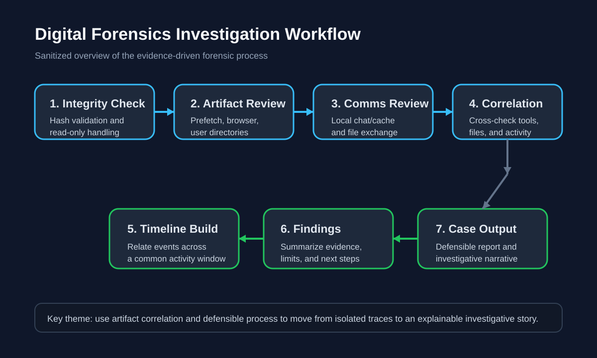
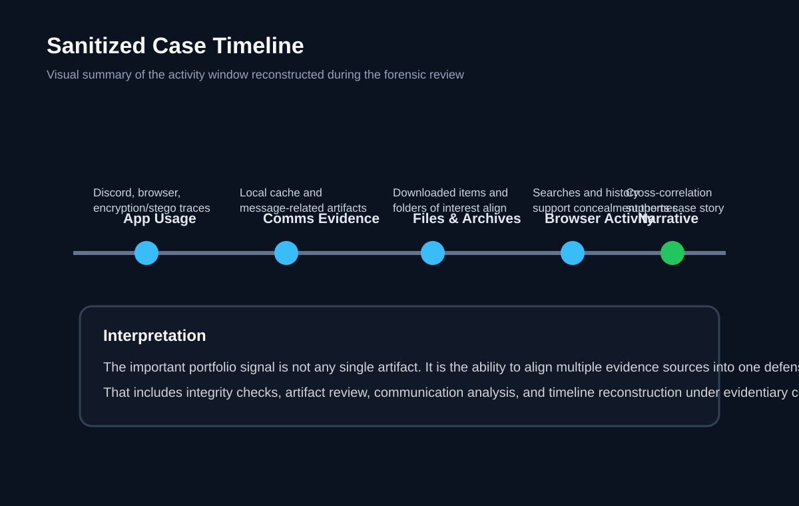

# Digital Forensics Evidence Lab

## Overview

This repository represents a resume-aligned digital forensics and evidence analysis project built around Windows disk-image investigation, artifact correlation, and structured case reporting. It shows how I validated evidence integrity, worked through application and browser artifacts, investigated data-hiding indicators, and translated multiple evidence sources into one defensible investigative narrative.

## What I Did

- validated MD5 integrity and mounted evidence in read-only mode
- examined `Prefetch`, `Discord` cache artifacts, Firefox `places.sqlite` history, downloads, user folders, and filesystem evidence
- correlated executed applications, communication identities, suspicious files, and concealment-related tooling
- used forensic workflows and tools including `Autopsy`, `PhotoRec`, `ExifTool`, `Hashcat`, `Wireshark`, `Steghide`, `DB Browser for SQLite`, and `Maigret`
- produced a structured case report with evidence validation, artifact correlation, findings, limitations, and follow-up recommendations

## Resume Alignment

This repo supports the resume project:

`Digital Forensics Investigation & Evidence Analysis Lab`

It is framed to show evidence handling and investigative workflow, not just a generic forensics topic.

## Visual Overview

## Real Tool Evidence

These screenshots were extracted from the original project documentation and show real evidence-handling and artifact-review steps:

More annotated evidence, including document and communication artifact notes, is in [docs/evidence-gallery.md](docs/evidence-gallery.md).

## Investigation Workflow

1. Validate evidence integrity and preserve a read-only examination path.
2. Review application execution traces to identify likely user behavior and tooling.
3. Examine local communication artifacts and exchanged file clues.
4. Review documents, downloads, and browser history for corroborating evidence.
5. Reconstruct a time-bounded activity narrative from multiple sources.
6. Write findings, limits, and next investigative steps in a structured report.

## Supporting Tooling

This repository now includes small analyst utilities in [`tools/`](tools) that mirror parts of the investigation workflow:

- export Firefox history from `places.sqlite`
- summarize executable names from Prefetch-related notes or exports
- turn evidence review into structured, reusable analysis steps

## Key Findings

- Evidence linked communication traces, suspicious files, and tool usage into one coordinated narrative.
- Prefetch and browser artifacts reinforced the interpretation of concealment-related behavior.
- The disk image contained signals of steganography and encrypted-volume usage that justified deeper follow-on work.
- Artifact correlation was the core strength of the case, not any single screenshot or file alone.

## Skills Demonstrated

`Digital Forensics` `Evidence Handling` `Artifact Correlation` `Hash Validation` `SQLite/Browser History Review` `Filesystem Analysis` `Steganography Awareness` `Forensic Reporting`