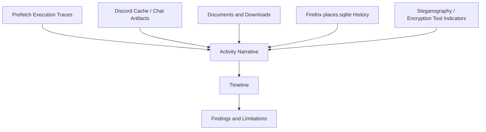

# Artifact Correlation

## Purpose

This artifact explains how separate forensic traces were correlated into a defensible activity narrative. The value of the project is not one isolated screenshot; it is the relationship between evidence sources.

## Correlation Map

## Artifact Categories

| Artifact Source | Example Evidence Type | Correlation Value |
|---|---|---|
| Prefetch | Application execution traces | Confirms tools were executed, not just installed. |
| Discord cache | Local communication artifacts | Supports communication timeline and file-transfer context. |
| Downloads | ZIP files, installers, shared artifacts | Connects communication to local files. |
| Documents | Spreadsheets, images, folders | Connects user storage to case narrative. |
| Browser history | URLs and search history in SQLite | Supports intent/context around tools, travel, data hiding, or downloads. |
| Data-hiding tools | Steganography/encryption indicators | Supports concealment hypothesis when combined with other artifacts. |

## Timeline Construction

| Step | Analyst Question |
|---|---|
| 1 | Which applications were executed? |
| 2 | What communication records exist locally? |
| 3 | Which files were created, downloaded, or referenced? |
| 4 | What web history supports or contradicts the artifact story? |
| 5 | Do timestamps align across sources? |
| 6 | What remains unproven because of missing passwords, unavailable carrier files, or limited scope? |

## Strong Reporting Language

Use careful evidence wording:

| Weak / Overstated | Stronger Forensic Wording |
|---|---|
| The user definitely hid evidence. | The artifacts indicate use of data-concealment tools and justify deeper examination. |
| This image proves the entire case. | This image supports the timeline when correlated with Prefetch and communication artifacts. |
| The encrypted file contains illegal material. | The encrypted container could not be reviewed without the password; its presence is a limitation and follow-up item. |
| The chat alone proves everything. | Chat artifacts should be correlated with local files, app execution, and browser history. |

## Interview Talking Point

> I built the case around artifact correlation. Prefetch showed tool execution, cache artifacts showed communication context, files and downloads showed local evidence, browser history showed user intent/context, and limitations were documented where encrypted or steganographic content could not be fully examined.
