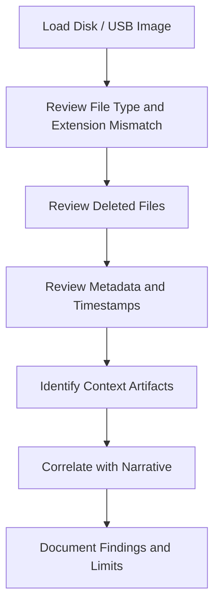

# Autopsy USB Analysis

## Purpose

This artifact summarizes Autopsy-based filesystem analysis in a public-safe way. It focuses on investigative method: extension mismatch review, deleted-file review, USB filesystem context, and artifact interpretation.

## Analysis Areas

| Area | What Was Reviewed | Defensive / Forensic Value |
|---|---|---|
| Extension mismatches | Files whose extension did not match detected content | Helps identify renamed or disguised files. |
| Deleted files | Deleted entries visible in the forensic tool | Helps recover or explain prior user activity. |
| USB filesystem | FAT32-style filesystem context | Supports device/file-system interpretation. |
| Browser/anonymity artifacts | TOR/anonymity references in the scenario | Supports investigation of privacy/anonymity tooling. |
| Payment/context artifacts | Cryptocurrency/payment references in the scenario | Helps build context when correlated with other evidence. |

## Autopsy Workflow

## Extension Mismatch Lesson

An extension mismatch is an investigative lead, not a final conclusion. A file may be renamed, misclassified, generated by an application, or deliberately disguised. The analyst should compare file headers, metadata, content preview, and surrounding context.

## Deleted-File Review Lesson

Deleted files can provide valuable context, but a report should distinguish:

- files that are recoverable;
- filenames visible only as metadata;
- files with partial content;
- files with timestamps that need corroboration;
- files that are relevant only after correlation with other artifacts.

## Public-Safe Notes

Do not publish full Autopsy screenshots if they expose private paths, recovered names, personal data, or raw case material. Use cropped screenshots or a generalized table instead.

## Interview Talking Point

> I used Autopsy to identify extension mismatches, review deleted-file entries, interpret USB filesystem context, and connect filesystem artifacts to the larger forensic narrative while avoiding overclaiming from a single tool result.
