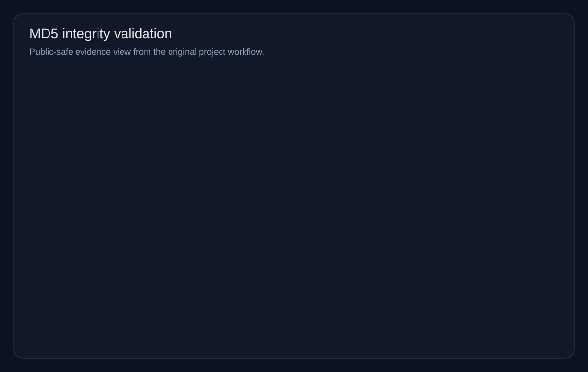
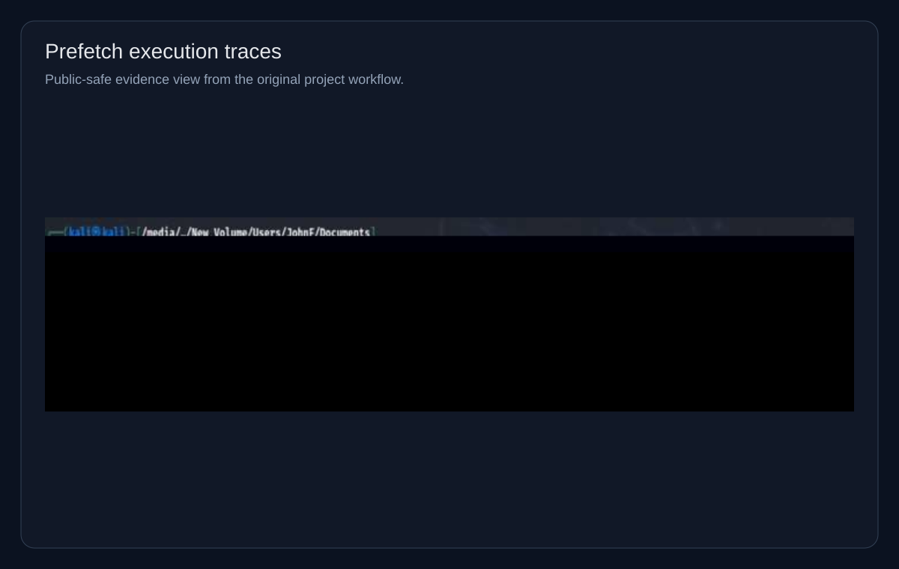

# Evidence Gallery

This gallery contains real screenshots extracted from the original forensic report. They are included to show the actual evidence-handling and artifact-review steps used during the investigation.

## Evidence Integrity

### MD5 Validation

This screenshot documents the integrity-check step that helped establish the disk image as a valid and unchanged evidence source before deeper review.

## Filesystem and User Artifact Review

### Documents and Suspicious Files

User-folder review notes captured how documents and suspicious files were enumerated and compared against other artifact sources.

### Prefetch Execution Traces

Prefetch artifacts helped identify which applications had actually executed, including tools relevant to communication, browsing, and possible concealment behavior.

## Communication and Artifact Correlation

### Discord Cache Artifact Review

Discord cache review helped connect communication-related traces to the broader case narrative and support artifact correlation.