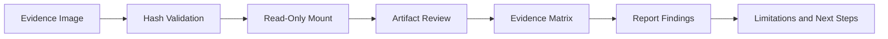

# Evidence Handling

## Purpose

Evidence handling is the foundation of a defensible forensic investigation. This artifact summarizes how the disk image was validated, scoped, and reviewed without publishing the raw image or private evidence.

## Evidence Handling Checklist

| Step | Purpose | Public-Safe Evidence |
|---|---|---|
| Identify evidence source | Establish what was examined. | Generalized disk-image description. |
| Validate hash | Confirm the working image matches the expected evidence hash. | MD5 validation screenshot/summary. |
| Preserve read-only handling | Avoid modifying the original evidence. | Read-only methodology notes. |
| Define scope | Prevent overclaiming beyond the provided evidence. | Scope statement: disk image only. |
| Record methodology | Make the work repeatable and reviewable. | Documented steps and tools. |
| Document limitations | Explain what could not be proven or accessed. | Limitations section. |

## Evidence Workflow

## Why Hash Validation Matters

Hash validation provides a digital fingerprint for the image. If the hash changes unexpectedly, the examiner cannot confidently say the evidence remained unchanged.

## Public-Safe Chain-of-Custody Style Table

| Item | Description |
|---|---|
| Evidence item | Sanitized forensic image copy |
| Original label | Generalized in public repo |
| Integrity method | MD5 validation |
| Handling mode | Read-only review |
| Examiner action | Artifact review and report writing |
| Public release status | Raw image not published |

## What Not To Publish

Do not publish raw disk images, recovered private files, exact personal identifiers, full chat logs, private photos, passwords, or screenshots showing sensitive victim/suspect information.

## Interview Talking Point

> I started with evidence integrity. Before analyzing artifacts, I validated the forensic image hash, preserved a read-only workflow, documented scope, and treated later conclusions as evidence-linked findings rather than assumptions.
