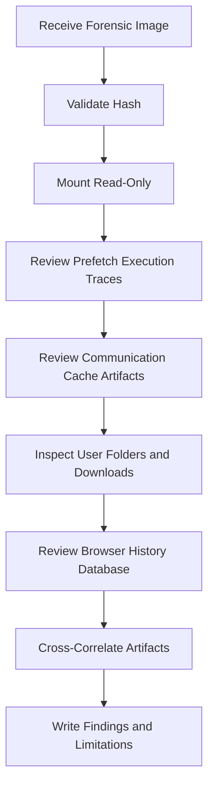

# Sanitized Forensic Case Study

## Public-Safe Scope

This case study summarizes a mock forensic report in sanitized form. It does not publish the raw disk image, recovered private files, raw chat logs, personal victim details, or unredacted assignment pages.

## Case Objective

The original analysis examined a forensic disk image to determine whether the system contained evidence of suspicious communications, data-concealment activity, and related user behavior.

## Evidence Source

| Field | Public-Safe Summary |
|---|---|
| Evidence type | Forensic disk image |
| Image name | Generalized from the original case image name |
| Integrity check | MD5 hash validation performed before analysis |
| Handling approach | Image mounted/read in a way that preserved the original evidence |
| Examination scope | Local disk image only; no live system or external systems were analyzed |

## Methodology

## Evidence Categories

| Evidence Category | What Was Reviewed | Why It Matters |
|---|---|---|
| Prefetch | Recently executed applications | Helped show which tools were actually run. |
| Communication cache | Local cache/log artifacts | Helped reconstruct communication-related activity. |
| User folders | Documents, Downloads, Desktop | Helped identify files that aligned with communication and activity indicators. |
| Browser history | SQLite browser history database | Helped corroborate searches and website visits. |
| Data-hiding indicators | Steganography/encryption-related tools and filenames | Helped identify possible concealment attempts. |
| Timeline | Activity dates and sequence | Helped connect separate artifacts into one investigative narrative. |

## Key Findings, Sanitized

| Finding Area | Sanitized Finding | Evidence Logic |
|---|---|---|
| Communication | Local chat/cache artifacts indicated coordination with multiple contacts. | Communication artifacts were correlated with files and application usage. |
| Data hiding | Steganography and encryption-related tool usage was indicated. | Prefetch and browser history supported the data-concealment hypothesis. |
| File artifacts | Multiple documents, compressed archives, and images were identified as relevant. | File names and locations aligned with communication and browser evidence. |
| Timeline | The relevant activity occurred within a narrow multi-day window. | Chat, file, and browser traces supported a coherent sequence. |
| Limitations | Some encrypted/steganographic content could not be fully examined. | Missing passwords/original carrier files limited full extraction. |

## Investigation Limitations

A mature forensic report should document what was not proven. In this case, the main limitations were:

- no live-system access;
- encrypted containers could not be opened without passwords;
- suspected steganographic images required original carrier files and/or passwords;
- chat logs required conversion before review;
- analysis was limited to the provided disk image.

## Follow-Up Recommendations

1. Preserve the original image and all derived exports.
2. Obtain legal authorization before reviewing additional devices or cloud accounts.
3. Request source chat/platform records through proper legal process if needed.
4. Attempt password recovery only within authorized scope.
5. Build a formal timeline from Prefetch, browser history, file timestamps, and communication artifacts.
6. Maintain a clear evidence matrix linking each finding to its artifact source.

## Interview Talking Point

> I treated the case as an evidence-correlation exercise. I validated the image hash, reviewed Prefetch, chat/cache artifacts, browser history, user folders, and data-hiding indicators, then wrote findings with explicit limitations so the report did not overstate what the evidence proved.
