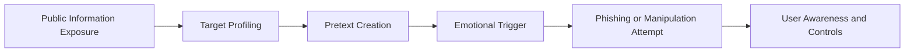

# OSINT and Social Engineering Defense

## Purpose

This artifact reframes OSINT and social-engineering coursework into defensive security awareness and investigation support. It intentionally avoids publishing offensive instructions or workplace-specific attack planning.

## Defensive OSINT Concepts

| Concept | Defensive Use |
|---|---|
| Passive collection awareness | Understand what information attackers can learn without touching the target. |
| Social media exposure review | Help users and organizations reduce oversharing. |
| Public document search | Find exposed sensitive files and remove or secure them. |
| Reverse image search | Support attribution, misinformation checks, and investigation leads. |
| OSINT framework usage | Structure legal and ethical collection for security reviews. |

## Social Engineering Risk Model

## Defensive Controls

| Risk | Defensive Control |
|---|---|
| Oversharing on public platforms | Privacy settings, awareness training, and public-profile review. |
| Phishing based on urgency or fear | User training, reporting buttons, email filtering, and simulation programs. |
| Exposed documents indexed online | Search monitoring, data-loss prevention, and takedown processes. |
| Public contact/identity leakage | Minimize unnecessary public contact details and use role-based inboxes. |
| Weak response process | Clear escalation paths for suspicious emails, calls, and messages. |

## Ethical OSINT Principles

1. Use OSINT only within legal and authorized boundaries.
2. Collect the minimum information needed for the defensive purpose.
3. Avoid doxxing, harassment, or targeting individuals.
4. Do not publish personal data gathered during OSINT research.
5. Document sources and reasoning without exposing private information.
6. Convert findings into protective actions.

## What Was Not Published

The raw source material included attack-chain style discussion. That content is not appropriate for a public portfolio. This repo uses a defensive version focused on awareness, detection, and risk reduction.

## Interview Talking Point

> I studied OSINT and social-engineering concepts, then reframed them defensively: how attackers gather public information, how emotional triggers increase phishing risk, and how organizations can reduce exposure through awareness, privacy controls, reporting, and public-document monitoring.
