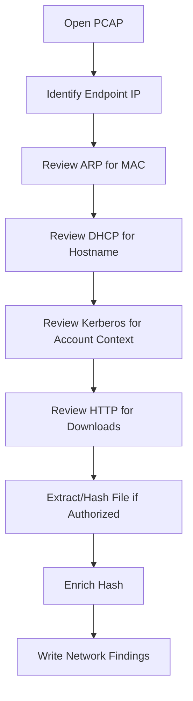

# PCAP Network Forensics

## Purpose

This artifact summarizes PCAP investigation work in a public-safe way. It avoids publishing raw PCAP files, live malware binaries, and full malicious URLs while showing the analysis workflow.

## PCAP Questions Answered

| Question Type | Evidence Source | Analyst Skill Demonstrated |
|---|---|---|
| Identify client MAC address | ARP traffic | Link IP activity to a hardware address/vendor context. |
| Identify Windows hostname | DHCP traffic | Extract endpoint identity from network negotiation. |
| Identify Windows user context | Kerberos traffic | Interpret authentication traffic carefully. |
| Identify executable download | HTTP traffic | Spot suspicious file retrieval from network evidence. |
| Hash downloaded file | SHA256 calculation | Convert downloaded artifact into a stable IOC. |
| Enrich hash | VirusTotal-style lookup | Connect artifact hash to malware-family context. |

## PCAP Workflow

## Sanitized Findings

| Finding Area | Sanitized Finding | Defensive Meaning |
|---|---|---|
| Endpoint identity | A Windows client was identified through IP, MAC, and DHCP artifacts. | Supports endpoint attribution inside the PCAP. |
| Hostname | DHCP traffic revealed a Windows host name. | Helps connect traffic to a machine identity. |
| Authentication context | Kerberos traffic showed machine/user account context. | Helps build an activity timeline, but must be handled carefully. |
| Suspicious download | HTTP traffic returned a Windows executable. | Indicates a potentially malicious download event. |
| File hash | SHA256 hash was calculated for the downloaded executable. | Allows safe hash-based enrichment without sharing the binary. |
| Malware context | Hash enrichment indicated Trojan/password-stealer style behavior. | Supports incident-response prioritization. |

## Public-Safe Reporting Rules

Do not publish:

- raw PCAP files;
- live malware binaries;
- full malicious URLs;
- personal user names from real environments;
- full internal IP maps from non-lab networks;
- payload contents.

Safe to publish:

- generalized workflow;
- sanitized findings;
- hash-only references when appropriate;
- defensive enrichment summaries;
- diagrams and tables.

## Interview Talking Point

> I used Wireshark-style PCAP analysis to identify endpoint metadata from ARP/DHCP, authentication context from Kerberos, suspicious HTTP download activity, and hash-based malware enrichment. I kept the public repo safe by documenting the method and findings without publishing the raw PCAP or executable.
