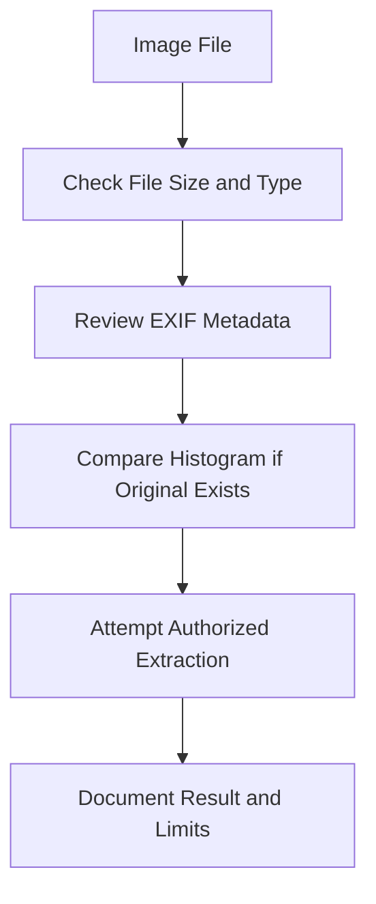

# Steganography and Metadata Lab

## Purpose

This artifact summarizes steganography, metadata, and password-hash lab work in a defensive forensic context. It does not publish passwords, private files, or full assignment pages.

## Steganography Concepts

| Concept | Defensive Meaning |
|---|---|
| Steghide-style embedding | Demonstrates that files can be hidden inside carrier images. |
| Original vs modified image size | A size change can be one clue, but it is not proof by itself. |
| Histogram comparison | Comparing original and modified images can reveal subtle changes when the original is available. |
| Extraction requirement | Extraction may require the correct password and original carrier context. |

## Metadata / EXIF Concepts

| Metadata Type | Investigative Value |
|---|---|
| GPS coordinates | Can identify where a photo was taken. |
| Camera model | Can connect images to a device type. |
| File timestamps | Can support timeline building, with caution. |
| EXIF removal | Reduces privacy exposure by removing location/device details. |

## Defensive Workflow

## Hashing / Password Concepts

The lab also covered password hashing and cracking-tool concepts. In a public portfolio, this should be framed defensively:

- passwords should be stored as salted hashes, not plaintext;
- hash type identification matters during authorized recovery;
- password recovery must be authorized and scoped;
- do not publish recovered passwords in a public repo.

## Public-Safe Evidence Strategy

Safe to publish:

- method summaries;
- sanitized histogram comparison screenshots;
- EXIF field categories without sensitive GPS if the location is personal;
- defensive lessons about metadata privacy.

Do not publish:

- recovered passwords;
- private images;
- exact personal GPS data from non-public photos;
- raw assignment screenshots with personal/course details.

## Interview Talking Point

> I used steganography and metadata labs to understand how hidden data and EXIF artifacts can support forensic investigation. I also learned to document uncertainty: a file-size change or metadata field is a clue, not proof unless supported by extraction and correlation.
